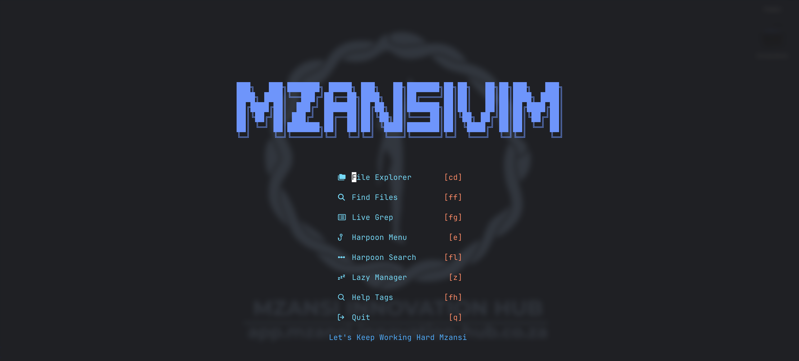

# Mzansi Vim: The No-Fuss Neovim Kickstart 🇿🇦



A pre-configured, performance-oriented Neovim setup designed to get you from zero to coding in minutes. Built for local developers who want a powerful IDE experience without the manual overhead of a 500-line `init.lua`.

## Key Features

* **LSP & Auto-completion:** Powered by `mason.nvim` and `nvim-cmp`, featuring out-of-the-box support for Python, Lua, Docker, SQL, and more.
* **First-Class Flutter Support:** Deep integration via `flutter-tools.nvim` for a seamless mobile development workflow.
* **Fast Navigation:** Includes `Harpoon` for rapid file switching and `Telescope` for fuzzy finding across your project.
* **Modern Aesthetics:** Features the `tokyonight` color scheme with enabled transparency and `lualine` for a sleek, functional status bar.
* **Syntax Highlighting:** Robust parsing for over 15 languages via `nvim-treesitter`.
* **Git Integration:** Quick access to Git commands using `vim-fugitive`.
* **Custom Dashboard:** A branded startup screen via `dashboard-nvim` with quick-access shortcuts to your most common actions.

## Essential Keybindings

The **Leader Key** is set to `Space`.

**Note:** Dashboard keybindings are active only on the dashboard screen and do not require the leader key prefix.

### Dashboard
| Action | Keybinding | Description |
| :--- | :--- | :--- |
| **File Explorer** | `cd` | Open Netrw directly from the dashboard. |
| **Find Files** | `ff` | Fuzzy find files via Telescope. |
| **Live Grep** | `fg` | Search across all files via Telescope. |
| **Harpoon Menu** | `e` | Open the Harpoon quick menu. |
| **Harpoon Search** | `fl` | Search Harpoon marks via Telescope. |
| **Lazy Manager** | `z` | Open the Lazy plugin manager. |
| **Help Tags** | `fh` | Search Neovim help tags via Telescope. |
| **Quit** | `q` | Quit Neovim. |
 

### Navigation & Searching
| Action | Keybinding | Description |
| :--- | :--- | :--- |
| **Dashboard** | `<leader>;` | Open the MzansiVim Dasboard. |
| **File Explorer** | `<leader>cd` | Open the built-in Netrw explorer. |
| **Find Files** | `<leader>ff` | Fuzzy find files in your project. |
| **Live Grep** | `<leader>fg` | Search for specific text across all files. |
| **Help Tags** | `<leader>fh` | Search through Neovim help documentation. |

### Harpoon (Quick-Switching)
| Action | Keybinding | Description |
| :--- | :--- | :--- |
| **Add File** | `<leader>a` | Mark the current file in Harpoon. |
| **Harpoon Menu** | `Ctrl + e` | View and manage your marked files. |
| **Harpoon Find** | `<leader>fl` | Use Telescope to search your Harpoon list. |
| **Quick Nav** | `Ctrl + h/t/n/s` | Jump instantly to Harpoon files 1, 2, 3, or 4. |

### LSP & Development
| Action | Keybinding | Description |
| :--- | :--- | :--- |
| **Hover Docs** | `K` | Display documentation for the symbol under cursor. |
| **Go to Definition**| `gd` | Jump to the source code of a function/variable. |
| **Code Actions** | `<leader>ca` | Show available fixes or refactors. |
| **Align File** | `<leader>af` | Auto align file. |
| **References** | `gr` | List all places where a symbol is used. |
| **Rename** | `<leader>rn` | Rename all occurrences of the symbol. |

### Diagnostics (Errors & Warnings)
| Action | Keybinding | Description |
| :--- | :--- | :--- |
| **Show Error** | `<leader>e` | Open a floating window with the full error under cursor. |
| **Next Error** | `]d` | Jump to the next diagnostic in the file. |
| **Previous Error** | `[d` | Jump to the previous diagnostic in the file. |
| **Error List** | `<leader>el` | Load all diagnostics into the quickfix list. |
| **Close Quickfix** | `:q <Enter>` | Close the quickfix window while active. |
 
### Window Management
| Action | Keybinding | Description |
| :--- | :--- | :--- |
| **Cycle Windows** | `Ctrl + w + w` | Cycle focus between open windows (e.g. quickfix ↔ code). |
| **Move Down** | `Ctrl + w + j` | Move focus to the window below. |
| **Move Up** | `Ctrl + w + k` | Move focus to the window above. |
| **Jump & Stay** | `Ctrl + w + Enter` | Open quickfix entry in a split, keeping quickfix focused. |
 
### Commenting
| Action | Keybinding | Description |
| :--- | :--- | :--- |
| **Toggle Comment** | `Ctrl + /` | Comment or uncomment the current line (normal mode). |
| **Toggle Comment** | `Ctrl + /` | Comment or uncomment the selection (visual mode). |

### Editor Essentials
| Action | Keybinding | Description |
| :--- | :--- | :--- |
| **Confirm Completion**| `Enter` | Accept the current suggestion in the popup menu. |
| **Scroll Docs** | `Ctrl + f / b` | Scroll up/down in the LSP documentation window. |

## Get Started

### Prerequisites
To ensure all plugins (LSP, Tree-sitter, and Telescope) function correctly, please install the following:

* **Neovim** (v0.10+ recommended)
* **Git** (For cloning the repo and managing plugins)
* **Tree-sitter-cli** (For syntax highlighting)
* **Ripgrep** (Required for Telescope live grep)
* **Node & NPM** (Required for various LSP servers like `html` and `eslint`)
* **Go** (Required for certain internal tools)

For the best results, we recommend you install and use the Ghostty terminal with the following configuration:

```Ini, TOML
theme = Adwaita Dark
font-size = 18
background-opacity = 0.85
background-blur-radius = 20
```

### Installation

#### 1. Prepare Configuration Directory
Depending on whether you have an existing setup, follow the appropriate step below:

**For a Fresh Install:**
If you have never configured Neovim, create the configuration folder:
```bash
mkdir ~/.config/nvim
```

**For an Existing Setup:**
If you have configured Neovim already, create a backup folder:
```bash
mv ~/.config/nvim ~/.config/nvim.bak
mkdir ~/.config/nvim
```

#### 2. Clone the Repository
Clone the Mzansi Vim configuration into your config folder:

```bash
cd ~/.config/nvim
git clone https://git.mzansi-innovation-hub.co.za/yaso_meth/mzansi_vim.git .
```

#### 3. Initialize
Simply launch Neovim:

```bash
nvim
```

## Additional information

For more details about Mzansi Vim, including usage instructions and updates, please visit the [MIH Gitea repository](https://git.mzansi-innovation-hub.co.za/yaso_meth/mzansi_vim.git).

### Contributing
Contributions are welcome! If you'd like to improve the package, please fork the repository, make your changes, and submit a pull request. For major changes, please open an issue first to discuss what you would like to change.

### Reporting Issues/ Feature Requests 
If you encounter any bugs or have feature requests, please log an issue on the [MIH Gitea Issues page](https://git.mzansi-innovation-hub.co.za/yaso_meth/mzansi_vim.git). Provide as much detail as possible to help us address the problem promptly.

### Support and Response 
We strive to respond to issues and pull requests in a timely manner. While this package is maintained voluntarily, we appreciate your patience and community involvement.

If you would like to support the MIH development team directly, please feel free to contribute to the [MIH Project via DonaHub](https://donahub.co.za/campaigns/mih-project)

Thank you for using the Mzansi Vim!
